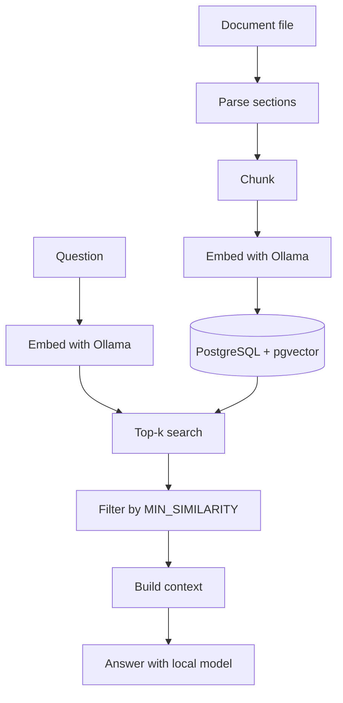

# RAG Learning Project

A small Go project for learning Retrieval-Augmented Generation (RAG) from first
principles. It chunks a document, embeds the chunks with a local Ollama server,
stores them in PostgreSQL with pgvector, retrieves the closest chunks for a
question, and asks a local model to answer using only those chunks. A separate
command scores retrieval quality and compares a lexical reranker against plain
vector search.

Three commands drive it — `cmd/ingest` loads a document, `cmd/rag` answers a
question, and `cmd/eval` scores retrieval. The full list, including the `make`
shortcuts, is in the [command reference](docs/reference/commands.md).

## Architecture


```mermaid
flowchart TD
    doc[Document file] --> parse[Parse sections]
    parse --> chunk[Chunk]
    chunk --> embed[Embed with Ollama]
    embed --> db[(PostgreSQL + pgvector)]
    q[Question] --> qembed[Embed with Ollama]
    qembed --> search[Top-k search]
    db --> search
    search --> filter[Filter by MIN_SIMILARITY]
    filter --> ctx[Build context]
    ctx --> answer[Answer with local model]
```

Retrieval is hybrid: vector search and PostgreSQL full-text search are fused with
reciprocal rank fusion, the top sections are deduplicated and expanded, and an
optional answerability gate decides whether the evidence can answer at all. See
the [architecture overview](docs/architecture/OVERVIEW.md) for the full picture.

## Requirements

- Go 1.26 or newer
- Ollama running locally, with an embedding model and a chat model:

  ```bash
  ollama pull nomic-embed-text
  ollama pull qwen3.8:27b-mlx   # or set OLLAMA_CHAT_MODEL to a model you have
  ```

- Docker (for the bundled PostgreSQL + pgvector)

## Quick start

Start the database and apply the migrations, then ingest a document, ask a
question, and score retrieval:

```bash
make db-up
make ingest
make ask Q="What happens if someone misses a payment?"
make eval
```

Every setting is read from the environment; [`.env.example`](.env.example) lists
them all. Copy it to `.env` and load it into your shell (Go does not read `.env`
files on its own):

```bash
cp .env.example .env
set -a; source .env; set +a
```

For running the commands directly, changing the embedding dimension, and the full
setup details, see the [usage guide](docs/guides/usage.md).

## Documentation

The full index — with a one-line "when to read it" for every document — lives in
[docs/README.md](docs/README.md). The major areas:

| Area                                                 | What is here                                                                                                                                                                                                                                                    |
| ---------------------------------------------------- | --------------------------------------------------------------------------------------------------------------------------------------------------------------------------------------------------------------------------------------------------------------- |
| [Requirements](docs/requirements/PRD.md)             | The canonical PRD, and the phase-23b PRD for proposed work                                                                                                                                                                                                      |
| [Architecture](docs/architecture/OVERVIEW.md)        | The RAG loop, package responsibilities, and boundaries                                                                                                                                                                                                          |
| [Reference](docs/reference/commands.md)              | Commands, [configuration](docs/reference/configuration.md), [capabilities](docs/reference/capabilities.md), [project structure](docs/reference/project-structure.md), [testing](docs/reference/testing.md), [experiments](docs/reference/experiments.md)        |
| [Guides](docs/guides/usage.md)                       | Task-oriented how-tos: [usage](docs/guides/usage.md), [evaluation](docs/guides/evaluation.md), [git hooks and agent scripts](docs/guides/agent-scripts.md)                                                                                                      |
| [Operations](docs/operations/embedding-dimension.md) | Operator-run procedures: [embedding dimension](docs/operations/embedding-dimension.md), [embedding models](docs/operations/embedding-models.md), [page provenance](docs/operations/page-provenance.md), [prompt injection](docs/operations/prompt-injection.md) |
| [Plans](docs/plans/PLAN.md)                          | The [engineering and learning plan](docs/plans/PLAN.md) and focused, SOP-compatible task plans (RAG-*)                                                                                                                                                          |
| [Lessons](docs/lessons.md)                           | The [lessons-learned](docs/lessons.md) retrospective (non-normative)                                                                                                                                                                                            |

## Status

The ingestion → chunking → embedding → retrieval → answer loop is complete, and
the gap-closure capabilities (RAG-006…RAG-015) are shipped and covered by tests —
see the [capabilities reference](docs/reference/capabilities.md). PDF text-layer
ingestion (RAG-007) and page provenance / page-aware citations (RAG-017) are also
implemented; the [architecture overview](docs/architecture/OVERVIEW.md) records
what ships today. OCR for scanned PDFs (RAG-008) and genealogy entity extraction
(RAG-016) are **not** implemented.

## Learning path

1. Generate embeddings with Ollama
2. Measure cosine similarity
3. Read raw embedding vectors from the Ollama `/api/embed` response
4. Add document chunking (now tunable: `CHUNK_SIZE` / `CHUNK_OVERLAP`)
5. Store embeddings in PostgreSQL + pgvector
6. Retrieve top-k chunks
7. Send retrieved context to a local Qwen model
8. Add metadata and citations
9. Add hybrid search and reranking (`cmd/eval` compares a lexical and an LLM reranker)
10. Add evaluation (`cmd/eval` reports recall and precision)
11. Add query transformation and multi-query retrieval (`QUERY_REWRITE`)
12. Gate answers on answerability, and judge facts, groundedness, and citations
13. Measure changes instead of guessing (`scripts/sweep.sh`)
