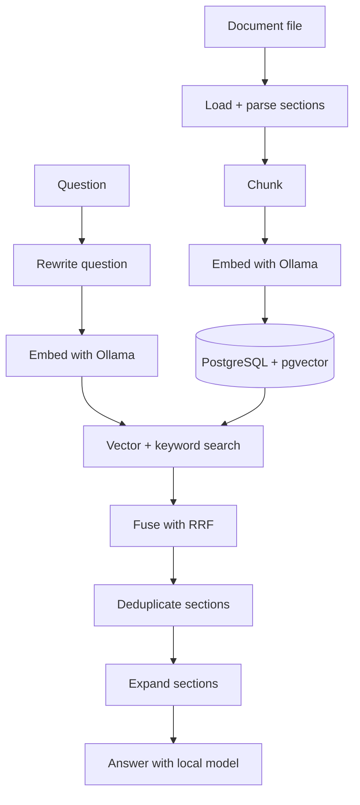

# Architecture overview

**Type:** descriptive — how the system is built today. Product requirements live in
the [PRD](../requirements/PRD.md); operator-run contracts live under
[`operations/`](../operations/embedding-dimension.md). This document links to those
rather than restating them.

## Purpose

The project exposes the major mechanics of Retrieval-Augmented Generation (RAG)
instead of hiding them behind a framework. It is deliberately small: three
commands wire a set of single-responsibility packages, and the retrieval pipeline
is one concrete implementation used by both answering and evaluation. See the
[project structure](../reference/project-structure.md) for the full layout.

## The RAG loop

Ingestion and querying are the two directions of that loop.

## Ingest path

`cmd/ingest` turns a file into stored chunk embeddings:

1. **Load** — [`internal/loader`](../../internal/loader) dispatches on the file
   format via a `Registry` (`Dispatch`). Markdown and plain-text loaders ship
   alongside a PDF text-layer loader; an unknown format returns
   `no loader for <path>`.
2. **Parse** — each loader returns `[]document.Section`
   ([`internal/document`](../../internal/document)); the boundary type consumed by
   the next stage.
3. **Chunk** — [`internal/chunking`](../../internal/chunking) splits each section
   into overlapping chunks (`CHUNK_SIZE` / `CHUNK_OVERLAP`) and copies the
   section's page through.
4. **Embed** — [`internal/embedding`](../../internal/embedding) calls the Ollama
   embed endpoint, resolved through the provider registry.
5. **Store** — [`internal/ingestion`](../../internal/ingestion) replaces the
   source's rows in one delete-then-insert transaction, so re-ingesting a file is
   a no-op when its content fingerprint and chunker config are unchanged (RAG-003).

## Query path

`cmd/rag` answers a question from the stored chunks:

1. **Rewrite** — [`internal/rag`](../../internal/rag) rewrites the question into a
   search query with the chat model (`QUERY_REWRITE`, on by default).
2. **Embed** — the original and rewritten queries are embedded.
3. **Retrieve** — [`internal/retrieval`](../../internal/retrieval) runs vector
   search (`<=>` over pgvector) and PostgreSQL full-text search for each query,
   fuses the rankings with reciprocal rank fusion, applies the `MIN_SIMILARITY`
   floor to vector-only candidates, and deduplicates sections.
4. **Expand** — each kept section expands to its chunks (`EXPAND_LIMIT` cap), so
   the context can be larger than the retrieval units (small-to-big).
5. **Rerank** *(optional)* — [`internal/reranking`](../../internal/reranking)
   reorders candidates lexically or with the chat model, with a bounded timeout
   and a fallback to the fused order (RAG-012).
6. **Budget** *(optional)* — [`internal/contextbudget`](../../internal/contextbudget)
   selects a byte-bounded subset of the ranked documents (RAG-010).
7. **Gate** — [`internal/answerability`](../../internal/answerability) asks the
   chat model whether the evidence can answer the question; if not, the command
   replies "I do not have enough information." (`RAG_ANSWERABILITY_GATE`, on).
8. **Answer** — [`internal/generation`](../../internal/generation) prompts the
   chat model to answer from the retrieved text only; optional citation validation
   and repair runs in [`internal/citations`](../../internal/citations) (RAG-013).

`cmd/eval` reuses steps 3–6 from the same `internal/retrieval` pipeline and scores
the result against `evals/retrieval.json` — see the
[evaluation guide](../guides/evaluation.md).

## Package responsibilities

| Package | Responsibility |
| ------- | -------------- |
| `internal/config` | Read settings; build the Ollama client and database pool |
| `internal/loader` | Detect a file's format and extract sections (Registry/Dispatch) |
| `internal/document` | Parse Markdown into sections; carry the page number |
| `internal/chunking` | Split sections into overlapping chunks |
| `internal/embedding` | Text → vector (Ollama `/api/embed`) |
| `internal/ollama` | Shared JSON client for the Ollama server |
| `internal/provider` | Embedder/generator provider registry (RAG-004) |
| `internal/ingestion` | Replace a source's chunks + embeddings atomically; schema guard |
| `internal/retrieval` | pgvector search, FTS, RRF fusion, dedup, expansion, filters |
| `internal/reranking` | Lexical + LLM rerankers with fallback and guard (RAG-012) |
| `internal/contextbudget` | Deterministic byte-estimate context budget (RAG-010) |
| `internal/answerability` | Ask the chat model whether the evidence answers the question |
| `internal/generation` | Prompt → answer (Ollama `/api/generate`) |
| `internal/rag` | Rewrite the question; build the answer prompt and context |
| `internal/citations` | Parse/validate/repair `[source - section]` citations (RAG-013) |
| `internal/observability` | Per-run reporter: human output or JSON `slog` (RAG-014) |

## Boundaries and ownership

- **Commands are thin.** `cmd/ingest`, `cmd/rag`, and `cmd/eval` wire packages
  together and own no retrieval or storage logic.
- **Provider seam.** Embedding and generation go through `internal/provider`
  interfaces (`EMBED_PROVIDER` / `GEN_PROVIDER`), so a non-Ollama provider is a
  registry entry, not an edit to the pipeline.
- **Storage contract.** The schema is owned by `migrations/*.sql`; the
  `documents.embedding` column dimension must match `EMBED_DIM`, enforced before
  any write by the schema guard in `internal/ingestion`
  ([procedure](../operations/embedding-dimension.md)).
- **Loader seam.** A new format is added by registering a `loader.Loader`, not by
  editing the ingest path.
- **One retrieval pipeline.** `internal/retrieval.HybridRetrieve` is the single
  implementation; `cmd/rag` and `cmd/eval` both call it, so evaluation measures
  what the command runs.
- **Untrusted text.** Retrieved content is treated as untrusted and separated from
  instructions in the answer prompt
  ([risk model](../operations/prompt-injection.md)).

## Data model

The store is the `documents` table
([`migrations/001_init.sql`](../../migrations/001_init.sql)) with an HNSW cosine
index (`documents_embedding_idx`):

| Column | Added by | Notes |
| ------ | -------- | ----- |
| `id`, `content`, `source`, `section`, `chunk_index`, `embedding vector(768)` | 001 | base chunk row + vector |
| `content_hash`, `embed_model`, `embedding_dim`, `chunker_config`, `ingested_at` | 002 | provenance; drives idempotent re-index (RAG-003) |
| `language` | 003 | per-document FTS configuration (RAG-009) |
| `page` | 004 | nullable 1-based page for paged formats (RAG-017) |

Every migration is idempotent (`IF NOT EXISTS`), so re-running is safe. The page
column's path from loader through citation rendering is specified in the
[page-provenance contract](../operations/page-provenance.md).

## Status: implemented vs proposed

- **Implemented and tested:** the ingestion → chunking → embedding → retrieval →
  answer loop; the gap-closure capabilities RAG-006…RAG-015
  ([capabilities reference](../reference/capabilities.md)); PDF text-layer
  ingestion (RAG-007) and page provenance / page-aware citations (RAG-017); and
  the bilingual evaluation harness (RAG-018/RAG-021).
- **Not implemented:** OCR for scanned PDFs (RAG-008 — a scanned PDF is rejected
  explicitly), and genealogy entity extraction (RAG-016).

> The [phase-23b PRD](../requirements/PRD-Phase-23b.md) and its
> [execution plan](../plans/PLAN-RAG-Phase-23b.md) still mark RAG-007/RAG-017 as
> frozen/proposed; that status was written before the commits that landed them
> (`c225ecb`, `0dec2ae`).

## Related documents

- [Project structure](../reference/project-structure.md) — the package layout.
- [Capabilities reference](../reference/capabilities.md) — what each capability does.
- [Configuration](../reference/configuration.md) — every environment setting.
- [Usage guide](../guides/usage.md) — running the pipeline by hand.
- [Evaluation guide](../guides/evaluation.md) — scoring and comparing settings.
- [Documentation index](../README.md).
