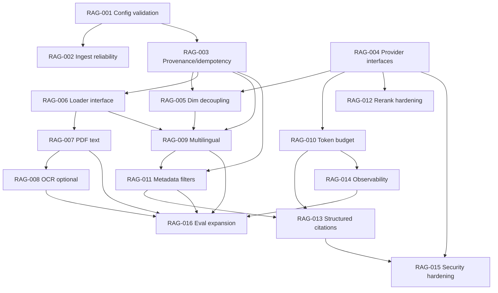

# PLAN-RAG-Gap-Closure

**Status:** Amended (Amendment A/B/C below) — initial execution narrowed to **M1–M2**; **M3–M6 deferred to a proposed Phase 23+**.
**Plan ID:** PLAN-RAG-Gap-Closure
**Author:** Agentic SOP gap audit (audit + plan only; no implementation)
**Repository:** `rag-template`
**Base commit:** `221fa45` (`feature/rag-gap-closure`)
**Supersedes:** none. Complements `docs/plans/PLAN.md` (Phases 1–18 complete, 19–22 open);
this plan closes the gaps those phases leave open plus the audit areas below.

---

## 1. Purpose

`rag-template` is a first-principles RAG learning system. `docs/requirements/PRD.md` and
`docs/plans/PLAN.md` declare the core loop complete (ingestion → chunking → embeddings
→ pgvector search → FTS → RRF → dedup → expansion → answerability → grounded
answer with citations → evaluation). This plan audits that system against ten
capability areas and closes the gaps **without** duplicating what already works.

Audit areas: retrieval quality, hybrid search, reranking, citations, ingestion
reliability, PDF/OCR, multilingual support, model independence, observability,
and security.

The plan is deliberately **model- and provider-independent**, and it prepares
for a future genealogy workload (scanned/PDF records, multiple languages, entity
and date provenance) **without implementing any genealogy-specific feature**.

## 2. Governance and scope

- **Planning only.** This document is a plan. It makes no runtime change.
- **Do not** commit, push, merge, tag, or bypass approvals as part of this plan.
- **Preserve** existing files, defaults, and SOP state. No task may silently
  change a shipped default; defaults change only with recorded experiment evidence
  (`docs/reference/experiments.md`), per the working method in `docs/plans/PLAN.md:333`.
- **Human review gate.** Work stops here for review before any task is scheduled
  or executed through `sop run`.
- **Non-duplication.** Every task below states what already exists and why the
  task is not a re-implementation.

### Relationship to the existing PRD non-goals

`docs/requirements/PRD.md:60` lists non-goals (SaaS, document-management product, distributed
vector platform, agent framework, production-scale ingestion). The areas audited
here (PDF/OCR, multilingual, observability, security) sit **outside** the current
PRD. This plan therefore proposes a **new, explicitly-scoped phase** ("Phase 23+")
rather than retrofitting those non-goals. Each task that crosses a non-goal marks
it and carries a "scope expansion" note for human decision.

### Amendment A — Initial execution scope (M1–M2 only)

Approved for initial execution: **Milestone 1 (RAG-001, RAG-002, RAG-003)** and
**Milestone 2 (RAG-004, RAG-005)**. These are the robustness and
model/provider-independence gaps that carry **no** `docs/requirements/PRD.md` non-goal conflict.

Execution is serial and evidence-gated: only **RAG-001** proceeds now. RAG-002
onward wait for human review of each predecessor; reaching a milestone boundary
does **not** authorize the next task.

### Amendment B — Deferred to proposed Phase 23+

The following milestones and tasks are **retained, not deleted**, but deferred to a
proposed **Phase 23+** because they cross `docs/requirements/PRD.md:60` non-goals or depend on
features that do:

- **Milestone 3** — RAG-006, RAG-007 (PDF), RAG-008 (OCR), RAG-009 (multilingual).
- **Milestone 4** — RAG-010 (token budget), RAG-011 (metadata filters),
  RAG-012 (rerank hardening), RAG-013 (structured citations).
- **Milestone 5** — RAG-014 (observability), RAG-015 (security hardening).
- **Milestone 6** — RAG-016 (evaluation harness/dataset expansion).

**Genealogy-specific extraction** (entities, relationships, places, dates,
GEDCOM/gramps parsing) is explicitly out of scope and is **not** represented as a
task anywhere in this plan; §8 lists only the enabling constraints. Their
dependency and acceptance fields below are preserved and forward-referenced for the
future phase.

### Amendment C — Frozen defaults and recorded deferrals

- **Defaults are frozen.** No default changes in M1–M2 unless a recorded
  evaluation row (`docs/reference/experiments.md`) supports it (`docs/plans/PLAN.md:333`).
- **Token-vs-character budget: DEFERRED** to RAG-010 (Phase 23+). The choice
  between a real tokenizer and a provider-neutral character estimate is **not**
  made now.
- **Integration-test blocker: RECORDED (standing).** RAG-002/003/005 acceptance
  requires the DB integration suite, currently unverified in this environment; see
  §9 and §10 B-01.
- **Nondeterministic-evaluation risk: RECORDED (standing).** Rewrite and LLM
  judges are nondeterministic (`docs/reference/experiments.md:211`); M1–M2 changes are
  config/schema only and must not be credited on single-run eval deltas. See §10 R-02.

### Amendment D — Multilingual scope expansion authorized (RAG-009 chain)

Recorded on operator authorization. This supersedes the Amendment B deferral for
**RAG-009 only**; the other deferred tasks keep their Amendment B status.

- **Multilingual scope expansion: AUTHORIZED.** RAG-009 (multilingual ingestion
  and retrieval) crosses a `docs/requirements/PRD.md:60` boundary and is now explicitly
  approved as the first Phase 23+ scope expansion. Its acceptance must keep the
  default `'english'` FTS behavior when a document's language is unset, so
  English-only corpora remain byte-identical to baseline.
- **Execution chain authorized in dependency order:** RAG-009 → RAG-011 →
  RAG-013 → RAG-015 (§7 graph). Each task runs through `sop run` only after its
  predecessor's acceptance criteria and required evidence are met; reaching a
  task boundary does **not** authorize the next task's commit.
- **No automatic commits.** RAG-009/011/013/015 complete locally (`LOCAL_DONE`) at
  most; each commit needs separate human authorization.
- **Still frozen:** RAG-007 (PDF), RAG-008 (OCR), and RAG-016 (eval capstone).
  RAG-016 depends on RAG-007/008 as well, so it remains blocked even after this
  chain.
- **Completed under Phase 23+ (recorded for context):** RAG-006 (`42611fd`),
  RAG-010 (`b2c31c9`), RAG-012 (`abe1a64`), RAG-014 (`7024a51`) are committed;
  their DB/eval gates remain NOT RUN in this environment (§10 B-01).

**Integration-test blocker: still standing.** RAG-009/011/013 acceptance requires
the DB integration suite; it is unverified here and must be recorded as NOT RUN
rather than passed (§9, §10 B-01).

### Amendment E — Implementation status (M1–M5 landed)

Recorded after the RAG-009 → RAG-011 → RAG-013 → RAG-015 chain landed and was
validated against a disposable PostgreSQL + pgvector instance. Supersedes the
deferral status for the tasks listed as done; the frozen set is unchanged.

- **Done and committed:** RAG-001 (`70296a3`), RAG-002 (`0f832b0`),
  RAG-003/004/005 incl. A/B/C (`32c8eaa` and history under `.agent-sdlc/archive/`),
  RAG-006 (`42611fd`), RAG-010 (`b2c31c9`), RAG-012 (`abe1a64`), RAG-014 (`7024a51`),
  RAG-009 (`f0ba7da`), RAG-011 (in `f0ba7da`), RAG-013 (in `f0ba7da`),
  RAG-015 (`1d04a20`). A dependency-fix commit (`b7a5d64`) and an ingestion
  provenance-lookup fix (`1076bfc`) also landed.
- **Verified (not just claimed):** the DB integration suite (25 tests) passed
  against a disposable PostgreSQL 16 + pgvector 0.6.0 instance; `make eval`
  reproduced the `docs/reference/experiments.md` baseline (citation validity **89/89**, and
  the 2/6 similarity-only rejection); `make sweep AXIS=rerank` recorded latency and
  fallback rows; `govulncheck ./...` is clean.
- **Still frozen / not implemented:** RAG-007 (PDF), RAG-008 (OCR), RAG-016 (eval
  capstone). These are scoped, still unimplemented, in `docs/requirements/PRD-Phase-23b.md` and
  `docs/plans/PLAN-RAG-Phase-23b.md`.
- **Historicalized:** `plan-rag-015` (disposition COMPLETE) under
  `.agent-sdlc/archive/`. No SOP plan is ACTIVE.
- **Out of scope (unchanged):** genealogy entity/person extraction remains a
  separate future scope; §8 is constraints only.

## 3. Current-state evidence

Verified against commit `221fa45`. File references are `path:line`.

| # | Capability | State | Evidence |
|---|-----------|-------|----------|
| 1 | Structured ingestion | Implemented | `internal/ingestion/ingestion.go`; `internal/document/document.go`; `migrations/001_init.sql` |
| 2 | Chunking (size/overlap) | Implemented | `internal/chunking/chunking.go:17` |
| 3 | Embeddings (Ollama) | Implemented | `internal/embedding/embedding.go:33` |
| 4 | Vector search (pgvector cosine) | Implemented | `internal/retrieval/retrieval.go:39` |
| 5 | Keyword search (Postgres FTS) | Implemented | `internal/retrieval/retrieval.go:146` |
| 6 | Hybrid RRF + deterministic tie-break | Implemented | `internal/retrieval/hybrid.go:13` |
| 7 | Section dedup | Implemented | `internal/retrieval/retrieval.go:102` |
| 8 | Section expansion (fair split) | Implemented | `internal/retrieval/retrieval.go:244` |
| 9 | Shared prod/eval pipeline | Implemented | `internal/retrieval/pipeline.go:131`,`:170` |
| 10 | MIN_SIMILARITY floor | Implemented | `internal/retrieval/retrieval.go:86` |
| 11 | Query rewrite (experiment) | Implemented, on by default | `internal/rag/rewrite.go:50`; `internal/config/config.go:64` |
| 12 | Reranking (lexical + LLM) | Implemented, **off by default in prod** | `internal/reranking/reranking.go:15`,`llm.go:36`; `config.go:39,43,122` |
| 13 | Answerability gate | Implemented | `internal/answerability/answerability.go:114` |
| 14 | Grounded generation prompt | Implemented | `internal/rag/answer.go:14` |
| 15 | Citations | **Prompt-only**, no structured output | `internal/rag/answer.go:26-32` |
| 16 | Evaluation metrics | Implemented (retrieval, evidence, facts, groundedness, citation validity/entailment) | `cmd/eval/main.go:729` |
| 17 | Eval dataset | 43 cases (37 answerable, 6 unanswerable) | `evals/retrieval.json`; `docs/reference/experiments.md:18` |
| 18 | Unit + DB integration tests | Implemented | `*_test.go`; `README.md:429` |
| 19 | Model/provider independence | **Partial** — Ollama concrete types; schema dim fixed | `embedding.go:12-21`; `generation.go:11-20`; `migrations/001_init.sql` `vector(768)` |
| 20 | PDF / OCR ingestion | **Missing** — markdown `## ` only | `internal/document/document.go:12` |
| 21 | Multilingual | **Missing** — FTS hardcoded `english` | `retrieval.go:161`,`:165` |
| 22 | Metadata filtering | **Missing** | no filter param in `Search`/`KeywordSearch` |
| 23 | Token/context budgeting | **Missing** — chunk-count caps only | `retrieval.go:244`; `docs/plans/PLAN.md:217` (Phase 19 "Next") |
| 24 | Ingestion reliability (batch/retry/provenance) | **Partial** — sequential per-chunk embed, no retry, no hash/metadata | `internal/ingestion/ingestion.go:49-64` |
| 25 | Observability | **Partial** — stdout stage prints only | `cmd/rag/main.go:317-425` |
| 26 | Security | **Baseline** — parameterized SQL; no limits/injection defense | `retrieval.go:40-56`; `internal/rag/answer.go:14` |

### Verified-absent / unverified

- **Absent (by code inspection):** PDF/OCR parsing, language detection, metadata
  filters, token accounting, structured logging/metrics, provider interfaces,
  content hashing, ingestion provenance columns.
- **Unverified in this session (not run):** DB integration tests
  (`RAG_INTEGRATION=1` + PostgreSQL), LLM-judge eval paths (`EVAL_FACT_JUDGE`,
  `EVAL_LLM_RERANK`, `EVAL_ANSWERABILITY_GATE`), `staticcheck`. See §7.

## 4. Gap matrix

Severity: **P0** blocks correctness/reliability · **P1** independence/formats ·
**P2** quality · **P3** operability.

| ID | Gap | Area | Severity | Current evidence |
|----|-----|------|----------|------------------|
| G-01 | Invalid chunk config silently yields zero chunks | Ingestion reliability | P0 | `chunking.go:54` returns `nil` when `overlap>=chunkSize`; `envIntOrDefault` ignores `<=0` (`config.go:155`) |
| G-02 | Per-chunk sequential embedding, no retry/backoff/batch | Ingestion reliability | P0 | `ingestion.go:49-64` |
| G-03 | No ingestion provenance or idempotency (hash, model, dim, time) | Ingestion reliability | P0 | `migrations/001_init.sql` columns; `ingestion.go` |
| G-04 | `source` is `filepath.Base` → basename collisions | Ingestion reliability | P0 | `cmd/ingest/main.go:51` |
| G-05 | Concrete Ollama types; no embedder/generator interface | Model independence | P1 | `embedding.go:12`; `generation.go:11` |
| G-06 | Schema hardcodes `vector(768)`, coupling model↔schema | Model independence | P1 | `migrations/001_init.sql` |
| G-07 | Only markdown `##` sections parsed | PDF/OCR | P1 | `document.go:12` |
| G-08 | No PDF text extraction, no OCR for scans | PDF/OCR | P1 | no parser beyond markdown |
| G-09 | FTS hardcoded `'english'`; no per-document language | Multilingual | P1 | `retrieval.go:161,165` |
| G-10 | No metadata filters (source/type/lang/date) in retrieval | Retrieval quality | P2 | `Search`/`KeywordSearch` signatures |
| G-11 | Context limited by chunk count, not model tokens | Retrieval quality | P2 | `retrieval.go:244`; `PLAN.md:217` |
| G-12 | Reranking off in prod; LLM-rerank has no fallback on parse failure | Reranking | P2 | `config.go:122`; `reranking/llm.go:59` |
| G-13 | Citations are free-text, never validated or repaired at runtime | Citations | P2 | `answer.go:26`; validation only in `cmd/eval/main.go:978` |
| G-14 | No structured logs, run IDs, stage timings, or token/cost accounting | Observability | P3 | `cmd/rag/main.go` prints only |
| G-15 | No input limits, prompt-injection defenses, or dependency scanning | Security | P3 | `answer.go:14`; `go.sum` |

### What already works (do **not** rebuild)

RRF fusion and its tie-break (`hybrid.go:54`), section dedup/expansion
(`retrieval.go:102`,`:244`), the shared eval/prod pipeline (`pipeline.go:131`),
answerability parsing (`answerability.go:200`), and the full evaluation metric
suite (`cmd/eval/main.go:729`) are complete and tested. Tasks below **extend**
them; none re-implements them.

## 5. Design constraints

1. **Provider independence.** No package outside `internal/ollama` names a vendor.
   Retrieval, ingestion, generation, reranking, answerability, and eval depend on
   interfaces, not concrete clients. Defaults remain Ollama + local models.
2. **Determinism first.** Prefer deterministic checks before LLM judges
   (`docs/plans/PLAN.md:281`; `docs/lessons.md` §13). New logic must be unit-testable
   without a database or model.
3. **Shared pipeline.** Any retrieval change flows through
   `HybridRetrieve`/`MultiQueryRetrieve` so eval reflects production.
4. **No default drift.** A default changes only with a recorded sweep row.
5. **No premature genealogy.** See §8. Genealogy-specific features are out of
   scope; only the enabling substrate is in scope.
6. **Additive migrations.** New SQL is `migrations/00N_*.sql`, idempotent, and must
   not mutate existing rows destructively without an explicit task note.

## 6. Prioritized tasks

> **Initial execution scope (Amendment A): M1–M2 only.** M3–M6 are deferred to
> proposed Phase 23+ (Amendment B) and retained unchanged below.

Each task: **Deps** (must be satisfied first), **Acceptance** (definition of
done), **Validation gate** (what makes it pass), **Rollback**.

---

### Milestone 1 — Robustness baseline — **in scope for initial execution**

#### RAG-001 — Config validation and actionable failures
- **Area:** Ingestion reliability (G-01).
- **Rationale:** `chunking.go:54` silently returns no chunks for
  `overlap >= size`; `envIntOrDefault` silently coerces non-positive ints to
  defaults. A user can ingest an empty corpus and only discover it at query time.
- **Scope:** Validate `CHUNK_SIZE`, `CHUNK_OVERLAP`, `TOP_K`, `FINAL_K`,
  `EXPAND_LIMIT`, `MIN_SIMILARITY`, `REQUEST_TIMEOUT` at load; return an error
  naming the offending variable. Make `cmd/ingest` fail when a document yields
  zero chunks. Do **not** change default values.
- **Non-duplication:** Adds validation around existing loaders
  (`config.go:106`); does not replace them.
- **Deps:** none.
- **Acceptance:**
  - `overlap >= size` and `size <= 0` produce a clear error, not empty output.
  - Ingesting a file with no `##` sections reports an explicit "no sections
    found" error.
  - Existing valid configurations behave identically.
- **Validation gate:** New unit tests in `internal/config` and `internal/chunking`
  asserting each rejection; `go test ./...` green; a manual `cmd/ingest` run on an
  empty file returns non-zero.
- **Rollback:** Revert commit; no schema or data change.

#### RAG-002 — Ingestion reliability: batching, concurrency, retry
- **Area:** Ingestion reliability (G-02).
- **Rationale:** `ingestion.go:49-64` embeds one chunk per HTTP round trip,
  serially, with no retry. A 100+ chunk document is slow and a single transient
  Ollama error aborts the whole ingest.
- **Scope:** Bounded-concurrency embedding (configurable worker count, default
  modest), retry with backoff on transient failures, and a single batched insert
  path (`CopyFrom` or multi-row insert) inside the existing transaction. Preserve
  the current atomicity guarantee (embeddings computed before the transaction;
  delete-then-insert) documented at `ingestion.go:29-38`.
- **Non-duplication:** Keeps `ReplaceDocument`'s transaction semantics; only the
  embedding loop and insert loop change.
- **Deps:** RAG-001 (config surface for concurrency/retry).
- **Acceptance:**
  - Embedding calls may run concurrently but results retain chunk order.
  - Transient errors retry a bounded number of times, then fail the ingest
    without leaving partial documents (integration test asserts this).
  - Wall-clock time for `examples/commercial-servicing-manual.md` drops materially
    versus baseline (record before/after).
- **Validation gate:** Existing `internal/ingestion` integration tests still pass
  (`RAG_INTEGRATION=1`); new test injects a flaky stub embedder and asserts retry +
  no partial write; unit test for the concurrency limiter.
- **Rollback:** Revert; no schema change. (Data is re-ingestable.)

#### RAG-003 — Ingestion provenance and idempotent re-index
- **Area:** Ingestion reliability (G-03, G-04).
- **Rationale:** `source` is `filepath.Base` (`cmd/ingest/main.go:51`) so
  `a/policy.md` and `b/policy.md` collide; there is no content hash, embedding
  model, dimension, chunker config, or timestamp stored, so "is this up to date?"
  is unanswerable.
- **Scope:** Add `migrations/002_ingestion_metadata.sql` with additive columns
  (`source_path`, `content_hash`, `embedding_model`, `embedding_dim`,
  `chunker_size`, `chunker_overlap`, `ingested_at`) and a `sources` table keyed by
  the canonical source path. Change `cmd/ingest` to use a canonical source
  identifier (path-relative or explicit `--source`), and skip re-embedding when
  `content_hash` + chunker config + model/dim are unchanged. **Do not** delete
  the existing `documents` columns; add only.
- **Non-duplication:** Extends `documents` and `ReplaceDocument`; does not change
  retrieval queries (they keep using `source`/`section`).
- **Deps:** none (coordinate migration numbering with RAG-005).
- **Acceptance:**
  - Re-ingesting an unchanged file is a no-op (no embeddings recomputed).
  - Changing content or chunker config re-ingests.
  - Two files with the same basename in different directories are distinct sources.
  - Provenance columns are populated and queryable.
- **Validation gate:** New integration test for skip/replace/collision;
  `make db-schema` idempotent; `go test ./...` green.
- **Rollback:** Keep migration (additive); drop new columns/table in a follow-up
  only if reverted before adoption. Data untouched.

---

### Milestone 2 — Model and provider independence — **in scope for initial execution**

#### RAG-004 — Embedder and generator provider interfaces
- **Area:** Model independence (G-05).
- **Rationale:** `embedding.Embedder` and `generation.Generator` wrap
  `*ollama.Client` concretely (`embedding.go:12-21`, `generation.go:11-20`);
  every caller is bound to Ollama.
- **Scope:** Introduce `embedding.Embedder` and `generation.Generator` as
  **interfaces** (`Embed(ctx,text)` / `Generate(ctx,prompt)`) with the current
  Ollama structs renamed to `ollamaEmbedder`/`ollamaGenerator` (or moved under
  `internal/provider/ollama`), plus a tiny provider registry selected by
  `EMBED_PROVIDER` / `GEN_PROVIDER` env vars (default `ollama`). `internal/ollama`
  remains the only vendor-aware package.
- **Non-duplication:** Pure refactor of existing types; behaviour unchanged.
- **Deps:** none.
- **Acceptance:**
  - No package except `internal/ollama` (and the registry) imports a vendor.
  - `config.Config` returns interface values; `cmd/*` and `internal/*` compile
    against interfaces.
  - A stub in-memory provider can drive ingestion + retrieval in tests.
  - Ollama remains the default and existing tests pass unchanged.
- **Validation gate:** `go build ./...`, `go vet ./...`, `go test ./...` green; new
  test wiring a fake provider end-to-end through the pipeline.
- **Rollback:** Revert; no schema change.

#### RAG-005 — Embedding-dimension decoupling and schema guard
- **Area:** Model independence (G-06).
- **Rationale:** `migrations/001_init.sql` fixes `vector(768)`, so a different
  embedding model (different dimension) cannot be used without editing SQL.
- **Scope:** Make the vector column dimension configuration-driven via a migration
  that reads a documented `EMBED_DIM` setting (or per-model dimension registry),
  and validate at startup that the retrieved/ingested dimension matches the column
  dimension, failing with a clear message. Document that changing dimension
  requires re-ingestion.
- **Non-duplication:** Extends migration 001; retrieval SQL is unchanged.
- **Deps:** RAG-003 (migration ordering), RAG-004 (provider/dim registry).
- **Acceptance:**
  - A non-768 model is usable after a documented migration + re-ingest.
  - Mismatched configured dimension fails fast with an actionable error.
  - Default path (`nomic-embed-text`, 768) is unchanged.
- **Validation gate:** Integration test ingesting with a stubbed non-768 provider
  against a matching column; startup test for mismatch; `make db-schema` idempotent.
- **Rollback:** Revert to `vector(768)`; requires re-ingest.

---

### Milestone 3 — Document formats and multilingual — **deferred to proposed Phase 23+**

#### RAG-006 — Pluggable document loader interface
- **Area:** PDF/OCR, multilingual (G-07).
- **Rationale:** Only `\n## ` markdown splits are supported (`document.go:12`).
- **Scope:** Introduce a loader/content-extractor interface (detect by
  extension/magic, return `[]document.Section`). Implement Markdown (existing
  behaviour, moved behind the interface) and plain text; leave HTML/PDF/OCR as
  separate tasks. `cmd/ingest` dispatches on the loader.
- **Non-duplication:** Wraps existing `ParseSections`; keeps its output contract
  and tests.
- **Deps:** RAG-003 (source identity).
- **Acceptance:**
  - `.md` and `.txt` ingest; unknown types return a clear "no loader" error.
  - Existing markdown tests pass unchanged.
- **Validation gate:** Unit tests per loader; `go test ./...` green.
- **Rollback:** Revert; ingestion reverts to markdown-only.

#### RAG-007 — PDF text-layer extraction
- **Area:** PDF/OCR (G-08). **Scope expansion** vs `PRD.md:60` non-goals.
- **Rationale:** Genealogy and real corpora include PDFs; only text-layer
  extraction (not OCR) is targeted here to keep the dependency surface small.
- **Scope:** Add a PDF loader producing sections (by heading/font heuristic or
  page + best-effort heading), preserving page provenance in a metadata field.
  Prefer a pure-Go library consistent with the current minimal-dependency posture
  (`go.mod` has effectively one dependency); if a CLI extractor is chosen instead,
  document the external runtime prerequisite.
- **Non-duplication:** New loader implementing the RAG-006 interface.
- **Deps:** RAG-006.
- **Acceptance:**
  - A text-layer PDF ingests into sections with page metadata.
  - A scanned/image-only PDF fails with an explicit "no text layer; OCR required"
    message (not silent empty).
- **Validation gate:** Unit/integration test on a small committed fixture; retrieval
  eval case added in RAG-016.
- **Rollback:** Remove loader + dependency; corpus unaffected.

#### RAG-008 — OCR path for scanned documents (optional)
- **Area:** PDF/OCR (G-08). **Scope expansion.**
- **Rationale:** Completes the scan story for genealogy records.
- **Scope:** Behind a build-tag/feature flag and the RAG-006 interface, add OCR for
  image-only PDFs/images via an external tool (e.g. `tesseract`) invoked as a
  subprocess, with a documented prerequisite and a deterministic "OCR disabled"
  fallback. **No** cloud OCR by default.
- **Non-duplication:** Separate loader; RAG-007 unchanged.
- **Deps:** RAG-006, RAG-007.
- **Acceptance:**
  - With OCR available, a scanned fixture ingests; without it, the loader is
    skipped with a clear note (mirrors the integration-test skip convention in
    `README.md:371`).
  - OCR output carries a confidence/quality caveat in metadata.
- **Validation gate:** Opt-in integration test; unit test for the disabled path.
- **Rollback:** Remove loader; no impact on other formats.

#### RAG-009 — Multilingual ingestion and retrieval
- **Area:** Multilingual (G-09). **Scope expansion.**
- **Rationale:** FTS is hardcoded to `'english'` (`retrieval.go:161,165`) and the
  default embedding model is English-centric, so non-English corpora degrade
  silently.
- **Scope:** Add a per-document `language` metadata field; select the FTS
  configuration from language (falling back to `simple` for unsupported languages);
  allow an embedding model per corpus (ties into RAG-004/005). Keep `'english'` as
  the default when language is unset so current results do not move.
- **Non-duplication:** Parameterizes existing FTS; RRF/dedup/expansion untouched.
- **Deps:** RAG-003 (metadata), RAG-006 (per-doc language capture), RAG-005 (model/dim).
- **Acceptance:**
  - A non-English document retrieves via language-appropriate FTS (`simple`
    fallback), verified by an added eval case.
  - English-only corpora produce identical results to baseline.
- **Validation gate:** Unit test for config selection; eval case in RAG-016;
  `go test ./...` green.
- **Rollback:** Revert to fixed `'english'`; metadata column is additive.

---

### Milestone 4 — Retrieval, reranking, citation quality — **deferred to proposed Phase 23+**

#### RAG-010 — Deterministic token/context budget
- **Area:** Retrieval quality (G-11). Corresponds to open `docs/plans/PLAN.md:217`.
- **Rationale:** `ExpandLimit` counts chunks (`retrieval.go:244`), not tokens, and
  expansion can exceed a nominal limit when many sections each get one chunk
  (`docs/plans/PLAN.md:223`).
- **Scope:** A deterministic context builder with an explicit token (or
  character, decided by experiment) budget: allocate across sections by fused
  rank, measure the budget with a model-agnostic tokenizer estimate, and never
  exceed it. Config-driven, with the current chunk-count behaviour available as a
  fallback.
- **Decision deferred (Amendment C):** whether the budget is measured in real
  tokens or in a provider-neutral character estimate is deferred to Phase 23+; no
  choice is made now.
- **Non-duplication:** Replaces only the final context-assembly step; RRF, dedup,
  and `SectionChunks` remain the candidate source.
- **Deps:** RAG-004 (provider-neutral tokenizer estimate).
- **Acceptance:**
  - Context never exceeds the configured budget.
  - Higher-ranked sections receive budget priority, with fairness across sections.
  - Evidence recall (before/after) is reported against the pre-change baseline.
- **Validation gate:** Unit tests for budget boundaries and fairness; eval run
  comparing evidence recall, latency, and token usage per `docs/plans/PLAN.md:235`.
- **Rollback:** Switch the builder back to chunk-count mode via config.

#### RAG-011 — Metadata filtering across retrieval
- **Area:** Retrieval quality (G-10). Enables future genealogy scoping.
- **Rationale:** No way to restrict retrieval to a source, language, document type,
  or date.
- **Scope:** Add an optional filter (source prefix, language, doc type, ingested
  date range) to `Search`, `KeywordSearch`, and `SectionChunks`, applied inside
  SQL with parameterized predicates. Thread the filter through
  `PipelineOptions` so eval can exercise it.
- **Non-duplication:** Extends, does not replace, the existing queries.
- **Deps:** RAG-003 (metadata columns), RAG-009 (language field).
- **Acceptance:**
  - Filtering reduces candidate sets correctly in vector, keyword, and expansion
    paths; unfiltered behaviour is byte-identical to baseline.
  - SQL injection safety preserved (parameterized; dynamic placeholders only).
- **Validation gate:** Integration tests for each filter dimension; unit test that
  no filter = baseline results.
- **Rollback:** Revert; filters default to "no filter".

#### RAG-012 — Reranking hardening and evaluation
- **Area:** Reranking (G-12).
- **Rationale:** `RAG_LLM_RERANK` defaults off (`config.go:122`) and
  `RerankLLM` aborts the whole request on a parse failure
  (`reranking/llm.go:59`, `parseRanking`). Experiments (`docs/reference/experiments.md:105`)
  measured it but did not promote it.
- **Scope:** On parse/validation failure, fall back deterministically to the
  fused order (log the fallback) instead of erroring; add a bounded latency guard;
  optionally evaluate a cross-encoder or a stronger LLM reranker behind the
  provider interface. Decide the default only from sweep evidence.
- **Non-duplication:** Extends `internal/reranking`; the lexical reranker and RRF
  baselines stay.
- **Deps:** RAG-004 (provider interface), RAG-010 (budget interaction).
- **Acceptance:**
  - A malformed reranker response degrades to the fused order; the request still
    answers.
  - New sweep rows compare off / lexical / LLM (/ cross-encoder) on recall,
    precision, evidence recall, and latency.
- **Validation gate:** Unit tests for fallback and guard; `make sweep` rows
  recorded in `docs/reference/experiments.md`.
- **Rollback:** Default stays off; revert the fallback change independently.

#### RAG-013 — Structured citations with runtime validation and repair
- **Area:** Citations (G-13).
- **Rationale:** Citations are free text `[source - section]` (`answer.go:26`) and
  are only validated offline in `cmd/eval/main.go:978`. A user of `cmd/rag` gets no
  guarantee a citation exists or is grounded.
- **Scope:** Parse the model's answer into structured citations bound to retrieved
  document IDs; validate each against the expanded set; on invalid/missing
  citations, either repair (strip invented ones) or re-prompt once. Optionally
  require the model to cite chunk-level IDs. Keep the human-readable
  `[source - section]` rendering.
- **Non-duplication:** Reuses the citation parser already proven in
  `cmd/eval/main.go:1057`; does not change the prompt's citation format contract.
- **Deps:** RAG-010 (final context), RAG-011 (document IDs stable).
- **Acceptance:**
  - Every citation in a `cmd/rag` answer resolves to a retrieved source/section.
  - Invalid citations are never shown as if valid; one repair attempt is bounded.
  - Eval citation validity stays ≥ baseline (baseline 89/89, `experiments.md:145`).
- **Validation gate:** Unit tests for parse/validate/repair; eval run confirming
  validity and entailment do not regress.
- **Rollback:** Return to raw model output; parser is additive.

---

### Milestone 5 — Observability and security — **deferred to proposed Phase 23+**

#### RAG-014 — Structured observability and accounting
- **Area:** Observability (G-14).
- **Rationale:** `cmd/rag` prints stages to stdout (`main.go:317-425`) and uses
  `log.Fatal`; there are no run IDs, stage timings, or token/cost accounting, so
  latency and spend cannot be attributed.
- **Scope:** Adopt `log/slog` (stdlib, keeps the dependency posture) with JSON
  output and a per-invocation run ID; emit per-stage timings (embed, vector,
  keyword, fuse, expand, judge, generate), retrieved/filtered counts, and
  token/context usage. Keep a human-readable mode as default for the learning
  flow. No external APM dependency.
- **Non-duplication:** The existing stage printers become one slog handler/mode;
  no behaviour removed.
- **Deps:** RAG-010 (token accounting).
- **Acceptance:**
  - Every run emits a correlated log record with stage timings and counts.
  - Token/context usage is reported per run.
  - Default human output is unchanged for the learning workflow.
- **Validation gate:** Unit test on the reporter; a scripted run asserts the log
  schema.
- **Rollback:** Revert; printing restored.

#### RAG-015 — Security hardening
- **Area:** Security (G-15).
- **Rationale:** SQL is parameterized (`retrieval.go:40-56`) — good — but there is no
  input size limit, retrieved document text is injected into prompts verbatim
  (prompt-injection surface, `answer.go:14`), and dependencies are not vulnerability
  scanned.
- **Scope:** (a) Bound question/document input sizes with clear errors; (b) delimit
  and label retrieved content in prompts so injected instructions are less likely
  to be followed, and document the residual risk; (c) confirm secrets are env-only
  (already true; add a `.env` ignore check); (d) add a dependency vulnerability scan
  to the local hooks (`govulncheck`), not to `pre-commit` if unavailable; (e) note
  service-auth/TLS as **future** (out of scope while this stays a CLI).
- **Non-duplication:** Hardening around existing prompts/queries; the tool remains
  read-only w.r.t. the repository.
- **Deps:** RAG-004 (provider seam), RAG-013 (citation trust).
- **Acceptance:**
  - Oversized inputs fail fast with actionable errors.
  - Prompt template clearly separates instructions from untrusted retrieved text.
  - `govulncheck ./...` reports no known vulnerabilities in the dependency set.
- **Validation gate:** Unit tests for limits; manual injection case documented;
  `govulncheck` run recorded.
- **Rollback:** Each sub-change is independent and revertible.

---

### Milestone 6 — Evaluation harness — **deferred to proposed Phase 23+**

#### RAG-016 — Evaluation harness and dataset expansion
- **Area:** All (verification substrate).
- **Rationale:** New capabilities (PDF, multilingual, filters, budget, citations,
  ingestion reliability) need cases and metrics, and several eval paths are
  nondeterministic (`experiments.md:211`).
- **Scope:** Extend `evals/retrieval.json` with PDF, non-English, filtered, and
  budget-boundary cases; add metrics for latency and token usage; add ingestion
  reliability cases (skip/replace/collision) to the integration suite; add a
  determinism control (fixed seed / temperature 0 where the provider allows) and
  record run-to-run variance so small deltas are not over-read.
- **Non-duplication:** Uses the existing metric suite (`cmd/eval/main.go:729`) and
  schema; adds cases and columns, not a new evaluator.
- **Deps:** RAG-007/008 (PDF/OCR cases), RAG-009 (multilingual cases),
  RAG-011 (filter cases), RAG-014 (metrics).
- **Acceptance:**
  - Dataset covers each new capability; metrics print for them.
  - Variance is reported for nondeterministic paths.
  - The full suite runs in the documented time budget (or a fast subset is defined).
- **Validation gate:** `go test ./...` + `RAG_INTEGRATION=1` integration +
  `make eval` (and `make sweep` for affected axes), results recorded in
  `docs/reference/experiments.md`.
- **Rollback:** Revert dataset additions; existing cases unaffected.

## 7. Dependency graph and sequencing

**Recommended first implementation task: RAG-001** (see §9) — it is unblocked, low
risk, high value, and a prerequisite for RAG-002/RAG-003.

Suggested milestone ordering: **M1 → M2 → M3 → M4 → M5 → M6**, with M6 cases
added incrementally as each capability lands (RAG-016 is a capstone, not a gate).

## 8. Future genealogy requirements (constraints only)

These are **not** tasks. No genealogy-specific feature (person entities, family
relationships, GEDCOM/gramps parsing, timeline/kinship graphs) is implemented by
this plan. Instead the plan ensures the substrate that genealogy will need is
independent and extensible:

- **Multi-format, including scans** — RAG-006/007/008 give a loader seam for
  scanned certificates, census pages, and typed records.
- **Multilingual** — RAG-009 handles records in multiple languages/scripts.
- **Provenance and citations** — RAG-003 + RAG-013 make every claim traceable to a
  specific source, page, and section: the core requirement for genealogical
  evidence.
- **Metadata scoping** — RAG-011 lets retrieval be scoped by record type, place,
  date, or collection without new schema.
- **Model/provider independence** — RAG-004/005 allow swapping to a
  domain-stronger or self-hosted model without touching pipeline code.
- **Observability/security** — RAG-014/015 provide the auditability and privacy
  guardrails that handling living-person data will require.

Any later genealogy plan should start from this substrate and add domain features
(entities, relationships, dates, places, privacy rules) as its own explicit phase.

## 9. Validation results (this audit)

Non-destructive checks run from the repository root at `221fa45`:

| Check | Command | Result |
|-------|---------|--------|
| Toolchain | `go version` | `go1.27.1 linux/amd64` (module requires `go 1.26.0`) |
| Build | `go build ./...` | **PASS** (exit 0) |
| Vet | `go vet ./...` | **PASS** (exit 0) |
| Format | `gofmt -l .` | **PASS** (no files listed) |
| Unit tests | `go test ./...` | **PASS** (all packages ok; `cmd/ingest`, `internal/embedding`, `internal/generation`, `internal/ollama` have no tests) |
| Integration | `RAG_INTEGRATION= ... -run Integration` | **SKIPPED** by design then (guard `integration_test.go:50`) — no PostgreSQL/Docker at that time. **Resolved later:** 8 PASS, 0 FAIL (see *Environment verification* below) |
| Static analysis | `staticcheck ./...` | **NOT RUN** then — not installed. **Resolved later:** PASS, no findings (see *Environment verification* below) |

Not executed (require models/DB) and therefore reported as **NOT RUN**:
LLM-judge eval paths (`EVAL_FACT_JUDGE`, `EVAL_LLM_RERANK`, `EVAL_ANSWERABILITY_GATE`),
`make eval`, `make sweep`, and the DB integration tests.

### RAG-001 verification (implementation pass)

Implemented on branch `feature/rag-gap-closure` in the working tree (**not committed**).

| Check | Command | Result |
|-------|---------|--------|
| Format | `gofmt -l .` | **PASS** (no files listed) |
| Vet | `go vet ./...` | **PASS** |
| Build | `go build ./...` | **PASS** |
| Unit tests | `go test -count=1 ./...` | **PASS** (all packages) |
| Race tests | `go test -race -count=1 ./...` | **PASS** (all packages) |
| Whitespace | `git diff --check` | **PASS** (exit 0) |
| Config cases | `go test -count=1 -run TestLoad ./internal/config/` | **PASS** (30 table subtests + `TestLoadDefaults`) |
| Static analysis | `staticcheck ./...` | **NOT RUN then** — not installed on `PATH`. **Resolved:** PASS, no findings (see *Environment verification* below) |
| DB integration | `RAG_INTEGRATION=1 go test ...` | **NOT RUN then** — no PostgreSQL/Docker. **Resolved for the tested local configuration:** 8 PASS, 0 FAIL (B-01, see below) |

Actionable-error smoke checks (each fails at `config.Load`, before any DB or model
call, exit 1):

- `CHUNK_OVERLAP=60` → `CHUNK_OVERLAP (60) must be smaller than CHUNK_SIZE (50)`
- `CHUNK_SIZE=0` → `CHUNK_SIZE must be greater than 0, got 0`
- `TOP_K=0` → `TOP_K must be greater than 0, got 0`
- `MIN_SIMILARITY=2` → `MIN_SIMILARITY must be between 0 and 1, got "2"`

Scope: `internal/config/config.go` and `internal/config/config_test.go`, plus the
six `config.Load()` call sites (`cmd/rag`, `cmd/ingest`, `cmd/eval`, and the two
integration test helpers), which now handle the returned error. **No** schema,
retrieval, ranking, embedding, generation, or provider change.

### RAG-001 acceptance review (final gate)

Review performed on branch `feature/rag-gap-closure` (working tree; **not committed**).
Decision: **FAIL — one acceptance criterion unmet (item 5)**; item 5 is the only
failure, all other items pass. *(Superseded: item 5 was then fixed — see
"RAG-001 item-5 fix and final acceptance" below, decision PASS.)*

| Review item | Result |
|-------------|--------|
| 1. Reviewed all 7 modified files + this plan | PASS |
| 2. Every `config.Load()` caller handles the error | PASS (5 call sites; see below) |
| 3. Invalid explicit values fail with actionable errors | PASS |
| 4. Valid configurations preserve previous behaviour/defaults | PASS |
| 5. Empty / no-`##`-section ingest exits nonzero with an explicit error | **FAIL** |
| 6. Change limited to RAG-001 (no retrieval/embedding/generation/schema/provider change) | PASS |
| 7. `gofmt -l .`, `go vet`, `go test -count=1`, `go test -race -count=1`, `go build`, `git diff --check` | PASS (all exit 0) |
| 8. Acceptance evidence + blockers recorded | this section |

Evidence:

- **Item 2.** `config.Load()` is called at `cmd/rag/main.go:31`,
  `cmd/ingest/main.go:30`, `cmd/eval/main.go:104`,
  `internal/ingestion/integration_test.go:76`, and
  `internal/retrieval/integration_test.go:63`; each now handles the returned error.
- **Item 3.** Explicit invalid values exit 1 with a named setting, before any DB or
  model call: `CHUNK_SIZE=abc` → `CHUNK_SIZE must be an integer, got "abc"`;
  `CHUNK_SIZE=10 CHUNK_OVERLAP=10` → `CHUNK_OVERLAP (10) must be smaller than
  CHUNK_SIZE (10)`; `REQUEST_TIMEOUT=0s` → `REQUEST_TIMEOUT must be greater than 0`;
  `EVAL_LLM_RERANK=maybe` → `EVAL_LLM_RERANK must be a boolean such as true or false`.
- **Item 4.** `TestLoadDefaults` passes (every setting falls back to its built-in
  default when absent); no `Default*` constant was edited; the valid/blank cases in
  `TestLoad` pass.
- **Item 6.** `git diff --name-only` lists only the 7 RAG-001 files; no change under
  `internal/retrieval/*.go` (non-test), `internal/embedding`, `internal/generation`,
  `internal/reranking`, `internal/answerability`, `internal/ollama`, or
  `migrations/`. The only `retrieval`-named file touched is
  `internal/retrieval/integration_test.go` (its `config.Load()` call site).

**Item 5 finding (unmet).** `cmd/ingest` has no guard for a document that yields
zero chunks. `loadChunks` returns `(nil, nil)`, `run` never checks `len(chunks)`,
and `Ingester.ReplaceDocument` runs `DELETE` + commit with zero inserts and returns
`nil`, printing `Ingested 0 chunks ...` (`cmd/ingest/main.go:53-57`). In this
environment an empty file and a heading-less file both exit 1, but **only** because
`cfg.Connect` cannot reach PostgreSQL — not because of validation. With a reachable
database the command would exit 0. Verified: `go run ./cmd/ingest /tmp/rag-empty.md`
and `... /tmp/rag-nosec.md` each report
`connect to postgres: ... connection refused`, not a sections error.

Minimum follow-up to satisfy item 5 (not implemented — review gate): after
`loadChunks`, if `len(chunks) == 0`, return an explicit error naming the path (for
example `no sections found in <path>`), so an empty or heading-less document exits
nonzero deterministically. This is within RAG-001 scope, not RAG-002.

Environmental blockers at the time (both since resolved — see *Environment
verification* below):

- `staticcheck ./...` was not installed on `PATH` (see `README.md:364`).
- DB integration tests could not run — no PostgreSQL/Docker available (B-01).

### RAG-001 item-5 fix and final acceptance (updated)

The item-5 gap recorded above was fixed under a narrowly authorized manual
implementation (a regular coding task, **not** a `/sop-continue` operation; SOP
state untouched).

- **Fix:** `cmd/ingest/main.go` now returns an explicit error before opening a
  database connection when a document yields zero chunks:
  `no sections found in <path>`. Previously such a document reached the database,
  deleted the source's rows, inserted nothing, and reported `Ingested 0 chunks`.
- **Tests:** `cmd/ingest/main_test.go` adds
  `TestRunRejectsDocumentWithoutSections` (empty, heading-less, and
  content-before-heading; asserts the explicit error names the path),
  `TestLoadChunksKeepsSections` (valid documents still chunk), and
  `TestIngestCommandExitsNonzeroWithoutSections` (builds the command and asserts a
  nonzero exit and the message on stderr).
- **CLI evidence:** `go run ./cmd/ingest <empty>` and `<heading-less>` each print
  `no sections found in <path>` and exit 1, without needing a database.

Nine RAG-001 acceptance criteria:

| # | Criterion | Result |
|---|-----------|--------|
| 1 | Invalid chunk sizes/overlaps rejected, incl. `CHUNK_OVERLAP >= CHUNK_SIZE` | **PASS** |
| 2 | Invalid non-positive values rejected where positive values are required | **PASS** |
| 3 | No silent coercion of invalid explicit values to defaults | **PASS** |
| 4 | Defaults preserved when env vars are absent/blank | **PASS** |
| 5 | Errors name the invalid setting | **PASS** |
| 6 | Table-driven config tests cover valid/invalid/boundary/missing | **PASS** |
| 7 | Change limited to RAG-001 (no retrieval/embedding/generation/schema/provider change) | **PASS** |
| 8 | Empty or heading-less document → explicit error + nonzero exit | **PASS** (item-5 fix) |
| 9 | Valid documents preserve previous behaviour | **PASS** |

Verification (this pass): `gofmt -l .` (no files), `go vet ./...` (exit 0),
`go test -count=1 ./...` (all packages ok), `go test -race -count=1 ./...` (all
packages ok), `go build ./...` (exit 0), `git diff --check` (exit 0).

RAG-001 decision (updated): **PASS**. The former environmental blockers for
`staticcheck` and the DB integration suite are resolved (see *Environment
verification* below).

### Environment verification (blockers resolved)

Environment: **Linux Mint 22.3 (Zena)**; **PostgreSQL 16 with pgvector** installed
and operational; `staticcheck 2026.2.1 (0.8.1)`.

| Check | Result | Source |
|-------|--------|--------|
| Native PostgreSQL integration tests (`internal/retrieval`, `internal/ingestion`) | **8 PASS, 0 FAIL** | environment verification on the tested local configuration |
| `staticcheck ./...` | **PASS** — no reported findings | environment verification; independently re-confirmed in the agent shell (`staticcheck 2026.2.1`, exit 0, no output) |
| `gofmt -l .`, `go vet ./...`, `go test -count=1 ./...`, `go test -race -count=1 ./...`, `go build ./...`, `git diff --check` | **PASS** | agent shell (see *RAG-001 verification* above) |

Consequences:

- **B-01 resolved** for the tested local configuration: the DB integration suite
  runs and passes 8/8. Other environments remain unverified.
- **Staticcheck environment blocker resolved:** `staticcheck` is available and
  reports no findings.

Preserved: the RAG-001 acceptance evidence above and the local commit
`70296a3` (`fix(rag): validate configuration and reject empty ingestion`) are
unchanged.

### RAG-003 validation recovery (evidence)

SOP ran RAG-003 to `LOCAL_DONE` (gate PASS), but SOP's configured gate
(`go build`/`go test`/`go vet`) covers neither formatting/Staticcheck nor the DB
integration suite. Independent verification found three failures, all
attributable to RAG-003:

| Gate | Failure | Classification | Root cause |
|------|---------|----------------|------------|
| `gofmt -l .` | `internal/ingestion/ingestion.go` unformatted | implementation | the change was never `gofmt`-ed |
| `staticcheck ./...` | `internal/config/chunker_config_test.go:51` SA4000 (identical expressions) | test | the determinism subtest compared `cfg.ChunkerConfig()` to itself |
| PostgreSQL integration (ingestion) | `column \"content_hash\" does not exist` | test / infrastructure | `002_ingestion_metadata.sql` was added, but both harnesses applied only `001_init.sql` |

Corrections (minimal, bounded; no test weakened, no gate skipped, no recovery budget raised):

- `gofmt -w internal/ingestion/ingestion.go`.
- `internal/config/chunker_config_test.go`: the determinism subtest now captures two
  calls into `first`/`second` and compares those, preserving the assertion while
  removing the self-comparison Staticcheck flags.
- `internal/ingestion/integration_test.go` and `internal/retrieval/integration_test.go`:
  `applyMigration` (hard-coded `001_init.sql`) replaced by `applyMigrations`, which
  globs and applies every `migrations/*.sql` in name order (as `make db-schema` does),
  so the tests pick up `002` against a fresh database; every statement is idempotent.

Preserved: ingestion provenance (content hash, embed model/dim, chunker config,
ingested-at), idempotent re-indexing (`IsUpToDate` skip), and document atomicity
(embeddings before the transaction; delete-then-insert) are unchanged.

Verification (recovery pass): `gofmt -l .` clean · `go vet ./...` PASS ·
`staticcheck ./...` PASS · `go build ./...` PASS · `go test -count=1 ./...` PASS ·
`go test -race -count=1 ./...` PASS · PostgreSQL integration **10 PASS / 0 FAIL**
(retrieval 5/5, ingestion 5/5) · `git diff --check` PASS.

Noted, **not** a gate failure (left unchanged to avoid a scope change): `002` names
the columns `embed_model`/`chunker_config` and adds no `sources` table / `source_path`
column, slightly differing from the RAG-003 scope wording. Core acceptance
(no-op re-ingest when unchanged, re-ingest on change, distinct sources via
`sourceName`, queryable provenance) is met.

Recorded here rather than in the active SOP plan `PLAN-RAG-003-005.md` so that plan's
source is not changed (a source change would require reconciliation, which this
authorization bars).

### RAG-004A/B/C decomposition — execution evidence

RAG-004 (BLOCKED, `NO_PROGRESS`) was superseded by the decomposed plan
`plan-rag-004abc` (`docs/plans/PLAN-RAG-004ABC.md`); the previous plan
`plan-rag-003-005` is archived `SUPERSEDED` with its FAILED history preserved (no PASS
or approval fabricated). SOP ran the three subtasks:

| Subtask | SOP status | Evidence |
|---------|-----------|----------|
| RAG-004A — Embedder interface + Ollama seam | **LOCAL_DONE** (PASS, 0 fix cycles) | `.agent-sdlc/runs/RAG-004A/report.md` |
| RAG-004B — Generator interface + Ollama seam | **LOCAL_DONE** (PASS, 0 fix cycles) | `.agent-sdlc/runs/RAG-004B/report.md` |
| RAG-004C — Provider registry + config interfaces + stub pipeline test | **BLOCKED** (`NO_PROGRESS`, TERMINAL) | `.agent-sdlc/runs/RAG-004C/report.md` |

RAG-004A added an `embedding.Embedder` interface and RAG-004B a `generation.Generator`
interface; `internal/ollama` remains the only vendor-importing package for
embedding/generation, so the pipeline stays provider-agnostic.

Findings (recorded; not fixed here):

- **RAG-004A test data race.** `internal/ingestion/embedder_stub_test.go` (new)
  mutates a plain field in `stubEmbedder.Embed` from the concurrent `mapOrdered`
  workers, so `go test -race` FAILS (`WARNING: DATA RACE`). SOP's gate does not run
  `-race`, so it passed there. The stub needs synchronization (e.g. an
  `atomic.Int64`/mutex).
- **RAG-004C blocked** (`repository_mutations=0`, 17 iterations, discovery stall): the
  task — registry + config factories + end-to-end stub test across a new package — is
  still broad enough to stall the model; it needs further decomposition or more
  precise file-scoped context.

Gates at this stop: `gofmt`/`go vet`/`staticcheck`/`go build` PASS; `go test ./...`
PASS; `go test -race ./...` **FAIL** (RAG-004A test race); PostgreSQL integration
**10 PASS / 0 FAIL**; `git diff --check` PASS.

## 10. Blockers, risks, and open questions

*Amendments A–C record the execution scope, the deferred decisions, and the standing
blockers below.*

- **B-01 (resolved for the tested local configuration).** The DB integration suite
  now runs and passes 8/8 on Linux Mint 22.3 with PostgreSQL 16 + pgvector (see §9
  *Environment verification*). The prior unverified caveat is lifted for that
  configuration; other environments remain unverified.
- **B-04 (staticcheck environment blocker — RESOLVED).** `staticcheck 2026.2.1`
  (0.8.1) is installed and `staticcheck ./...` reports no findings (see §9
  *Environment verification*).
- **B-02 (scope).** RAG-007/008/009/010/011/012/013/014/015 cross `docs/requirements/PRD.md`
  non-goals and are deferred to proposed Phase 23+; they require an explicit human
  decision to open that phase.
- **B-03 (RAG-001 acceptance gap). RESOLVED.** Item 5 was closed by the item-5
  fix recorded in §9 (`cmd/ingest` now fails with `no sections found in <path>`;
  regression tests added). No longer a blocker.
- **R-01 (default drift).** Several tasks touch defaults (chunk size, rerank).
  `docs/reference/experiments.md:199` already flags the chunk-size default as unresolved;
  this plan forbids default changes without recorded sweep evidence.
- **R-02 (standing risk — nondeterminism).** Rewrite and LLM judges are
  nondeterministic (`experiments.md:211`); RAG-016 (Phase 23+) must quantify variance
  before any task claims a win. M1–M2 are config/schema changes and must not be
  credited on single-run eval deltas.
- **R-03 (dependencies).** RAG-007/008 add dependencies or external tools to a
  project with one direct dependency; each must justify its footprint.
- **Q-01.** Is PDF/OCR in scope for this repository, or should it live in a
  separate ingestion tool that writes to the same schema?
- **Q-02 (deferred to RAG-010, Phase 23+).** Should the token budget be token-based
  (needs a real tokenizer) or character-based (provider-neutral approximation)? No
  decision is required for M1–M2.
- **Q-03.** Should `cmd/rag` gain a runtime answerability/rerank default change, or
  stay a study tool with experiments opt-in?

## 11. Definition of done (for this plan)

This plan is done when a human has reviewed and either accepted, amended, or
rejected it, and (if accepted) scheduled its tasks through SOP. No task in §6 is
implemented under this plan.

## 12. Rollback and change control

- Every task is independently revertible; none requires destructive data
  migration. New SQL is additive and idempotent.
- Defaults move only with recorded evidence in `docs/reference/experiments.md`.
- No commit, push, merge, or approval is performed by this plan.
