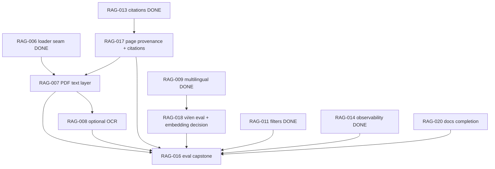

# PLAN — RAG Phase 23b: PDF, page provenance, OCR, and evaluation

**Type:** Proposed execution plan (planning only; makes no runtime change).
**Status:** **PROPOSED — NOT ACTIVE.** RAG-007, RAG-008, and RAG-016 (and the new
RAG-017/RAG-018/RAG-020) stay **frozen** until the operator explicitly opens
Phase 23b. This document does not activate, schedule, or approve anything.
**Author:** RAG documentation and planning pass (plan only; no implementation).
**Repository:** `rag-template`
**Branch at authoring:** `feature/rag-gap-closure` @ `1d04a20`
**Supersedes:** the remaining (unlanded) parts of `docs/plans/PLAN-RAG-Phase-23.md`.
That plan's RAG-006/009/010/011/012/013/014/015 tasks have landed (see
`docs/plans/PLAN-RAG-Gap-Closure.md` Amendment E); this plan covers only what is
left. The original Phase-23 plan is **preserved unchanged** for history.
**Product requirements:** `docs/requirements/PRD-Phase-23b.md`.

---

## 1. Purpose

Turn the remaining deferred backlog into small, independently testable batches:
PDF text-layer ingestion, explicit page provenance, page-aware citations, an
opt-in OCR path, a Vietnamese/English retrieval evaluation with a recorded
embedding decision, the evaluation capstone, and a documentation completion task.
Every task reuses the existing pipeline (`loader.Registry`/`Dispatch`, chunking,
ingestion, retrieval, `contextbudget`, `citations`, `provider`) and is additive and
default-preserving.

## 2. Governance, scope, and safety

- **Planning only.** No task is implemented by writing this plan.
- **Frozen until authorized.** RAG-007/008/016 stay frozen; RAG-017/018/020 are new
  and equally inactive. Only the operator opening Phase 23b unfreezes them.
- **PRD non-goal crossings need an explicit decision.** RAG-007 (PDF) and RAG-008
  (OCR) cross `docs/requirements/PRD.md` §5. RAG-018 (Vietnamese/English evaluation) sits within
  the multilingual scope already authorized by Amendment D. RAG-017/016/020 add no
  new product surface.
- **Additive, idempotent migrations only.** Schema changes are `migrations/00N_*.sql`,
  idempotent, and non-destructive. Operator procedures live under `docs/operations/`.
- **No default drift.** A shipped default changes only with a recorded row in
  `docs/reference/experiments.md`.
- **Preserve legacy behaviour.** Markdown/plain-text ingestion and existing eval
  cases are byte-identical when the new formats/settings are unused.
- **No commit / push / merge / approval; human boundary after every batch.**
- **Genealogy entity extraction is out of scope** (separate future phase; §8 of the
  gap-closure plan is constraints only).

## 3. Backlog (Phase 23b)

| ID | Task | Depends on | PRD non-goal | Gate |
|----|------|-----------|--------------|------|
| RAG-017 | Page provenance and page-aware citations (contract first) | RAG-013 ✅ | no | unit + integration + eval |
| RAG-007 | PDF text-layer loader (one section per page) | RAG-017, RAG-006 ✅ | **yes** (scope expansion) | unit + fixture |
| RAG-008 | Optional OCR fallback for scanned PDFs | RAG-007 | **yes** (scope expansion) | opt-in integration |
| RAG-018 | Vietnamese/English retrieval evaluation + embedding decision | RAG-009 ✅ | within Amendment D (multilingual) | integration + eval |
| RAG-016 | Evaluation harness and dataset expansion (capstone) | RAG-007, RAG-008, RAG-017, RAG-018, RAG-011 ✅, RAG-014 ✅ | no | integration + eval + sweep |
| RAG-020 | Documentation completion (README/PRD/PLAN reconciliation) | none | no | docs review |

## 4. Dependency graph



**Sequencing note.** RAG-017 (page provenance) **must** land **before** `PDFLoader`
is written (`docs/requirements/PRD-Phase-23b.md` §6): the page contract touches
`document.Section`, `migrations/004`, chunking, ingestion, `FormatContext`, and
`citations`, and a PDF loader that invents its own page encoding would have to be
unwound. The dependency therefore runs **RAG-017 → RAG-007** (page contract first,
extractor second).

## 5. Dependency waves and shared-file conflicts

**Dependency waves (safe ceiling):**

- **Wave 0 (ready now):** RAG-020 (docs only).
- **Wave 1:** RAG-017 (page contract) and RAG-018 (vi/en eval) — disjoint
  (`internal/document`+`internal/ingestion` vs `evals/`).
- **Wave 2:** RAG-007 (PDF text layer) — depends on the RAG-017 page contract;
  shares `internal/loader`/ingest with nothing else in this wave.
- **Wave 3:** RAG-008 (OCR, depends on RAG-007; shares `internal/loader` ⇒ serialize).
- **Wave 4:** RAG-016 (capstone) once RAG-007/008/017/018 have landed.

**Shared-file conflicts (why parallelism is limited):**

| File / area | Tasks that write it |
|-------------|---------------------|
| `internal/loader/*` | RAG-007 (PDF), RAG-008 (OCR), RAG-017 (page plumbing through loader output) |
| `internal/document/*` | RAG-017 (`Section.Page`) |
| `migrations/00N_*.sql` | RAG-017 (page column); RAG-018 (only if an embedding change is adopted) |
| `internal/chunking`, `internal/ingestion` | RAG-017 (carry page through) |
| `internal/rag/*`, `internal/citations/*` | RAG-017 (page citation form) |
| `cmd/eval/main.go`, `evals/`, `docs/reference/experiments.md` | RAG-018, RAG-016 |
| `README.md`, `docs/*.md` | RAG-020 (and any task that records a decision) |

**Parallel workstreams (file-disjoint ⇒ may run concurrently if each gets an
isolated working tree; the default is serial):**

- **WS-A formats** — RAG-007 → RAG-008 (`internal/loader`, `cmd/ingest`, config).
- **WS-B provenance/citations** — RAG-017 (`internal/document`, chunking,
  ingestion, `internal/rag`, `internal/citations`, `migrations/004`).
- **WS-C evaluation** — RAG-018 → RAG-016 (`evals/`, `cmd/eval`,
  `docs/reference/experiments.md`).
- **WS-D docs** — RAG-020 (`README.md`, `docs/`).

WS-A and WS-B both touch `internal/loader` and the ingest path ⇒ **serialize** (or
land the page contract in WS-B first). WS-C and WS-B both touch `cmd/eval` ⇒
**serialize**. WS-D is disjoint from code but shares `docs/reference/experiments.md` with
WS-C ⇒ coordinate. The recommended mode remains **serial in wave order**, with a
human boundary after each batch.

## 6. Batches

### Batch 1 — Documentation completion: RAG-020
- **Tasks:** RAG-020 (README config table + architecture; reconcile `docs/plans/PLAN.md`,
  `docs/requirements/PRD.md`, `PLAN-RAG-Gap-Closure.md`; keep implemented vs proposed distinct).
- **Acceptance:** README's config table matches `internal/config`; architecture
  sections name the loader/citations/contextbudget/observability/provider packages;
  plan/PRD status notes are accurate; `PLAN-RAG-Phase-23.md` untouched.
- **Validation:** documentation review; link check; no code change (`git status`
  shows only docs).
- **Boundary:** human review.

### Batch 2 — Page provenance and citations: RAG-017
- **Tasks:** RAG-017 (`Section.Page`; `migrations/004` nullable `documents.page`;
  carry through chunking/ingestion; extend `FormatContext` and
  `internal/citations` to an explicit page form; legacy no-page answers stay valid).
  This is the page-provenance **contract**, landed before any `PDFLoader`.
- **Acceptance:** page round-trips; re-ingest of unchanged content is a no-op; a page
  citation resolves to a retrieved page; an invalid page citation is never shown as
  valid; Markdown/text behaviour unchanged.
- **Validation:** unit tests (round-trip, citation parse/validate/repair) + the
  PostgreSQL integration suite (`-p 1`) + `make eval`.
- **Risks:** cross-cutting schema/format change; must be additive and default-safe.
- **Rollback:** drop the column (additive) and revert the citation form; keep the
  legacy format.
- **Boundary:** human review.

### Batch 3 — PDF text layer: RAG-007
- **Tasks:** RAG-007 (register a `PDFLoader`; extract the text layer; one section
  per page, using the RAG-017 page contract; explicit "no text layer; OCR required"
  on scans).
- **Fixtures:** a small committed text-layer PDF and a scanned/no-text-layer PDF.
- **Acceptance:** text-layer PDF ingests with one section per page carrying the page
  number; scanned PDF fails explicitly; source identity preserved; malformed PDF
  errors, never panics.
- **Validation:** unit tests per loader; `go build/vet/test`; `govulncheck` clean
  after the new dependency; the PostgreSQL integration suite for page round-trip.
- **Risks:** new PDF dependency (supply-chain surface); malformed inputs.
- **Rollback:** remove the loader registration + dependency; Markdown/text untouched.
- **Boundary:** human review.

### Batch 4 — Optional OCR: RAG-008
- **Tasks:** RAG-008 (detect no-text-layer; opt-in OCR path; skip with a clear note
  when the engine is absent; carry page provenance; document the quality caveat).
- **Fixtures:** the scanned PDF from Batch 3.
- **Acceptance:** with OCR enabled+available the scanned fixture ingests; without it
  the loader is skipped with a note and no error; OCR output preserves page numbers.
- **Validation:** opt-in integration test + a disabled-path unit test.
- **Risks:** external OCR engine (availability, speed, quality).
- **Rollback:** disable the setting; the PDF loader reverts to explicit failure.
- **Boundary:** human review.

### Batch 5 — Multilingual evaluation and embedding decision: RAG-018
- **Tasks:** RAG-018 (add Vietnamese + English corpus/cases; run retrieval metrics;
  record whether the default embedding model suffices or a multilingual model is
  adopted — as an explicit, recorded decision with a migration note, not a default
  change).
- **Acceptance:** the vi/en corpus ingests and retrieves; English baseline
  unchanged; the embedding decision is recorded in `docs/reference/experiments.md`.
- **Validation:** `RAG_INTEGRATION=1` integration + `make eval`; record variance.
- **Risks:** embedding quality for Vietnamese; nondeterministic metrics.
- **Rollback:** revert the corpus/case additions; no default changed.
- **Boundary:** human review.

### Batch 6 — Evaluation capstone: RAG-016
- **Tasks:** RAG-016 (extend the dataset with PDF, page-citation, multilingual, and
  RAG-009/010/011 cases; add variance control; define a fast subset if needed).
- **Acceptance:** metrics print for each capability; variance reported for the
  nondeterministic paths; suite runs within the documented budget (or a documented
  subset).
- **Validation:** `go test ./...` + `RAG_INTEGRATION=1` integration + `make eval` +
  `make sweep`; rows recorded in `docs/reference/experiments.md`.
- **Risks:** runtime; nondeterminism.
- **Rollback:** revert dataset additions; existing cases unaffected.
- **Boundary:** human review; then the Phase-23b plan is a historicalization candidate.

## 7. Validation gates

- **Unit (all):** `go test ./...` (no database, no model).
- **Race (concurrency-touching):** `go test -race ./...`.
- **PostgreSQL integration (DB-touching):** `RAG_INTEGRATION=1 go test
  ./internal/retrieval/ ./internal/ingestion/ -run Integration -p 1 -v` against a
  throwaway database; never the dev database.
- **Eval / sweep (quality):** `make eval`, `make sweep AXIS=<axis>`; record rows in
  `docs/reference/experiments.md`.
- **Build/lint/security:** `go build ./...`, `go vet ./...`, `govulncheck ./...`.

## 8. First batch recommended for approval

**Recommended: Batch 1 = RAG-020 (documentation completion).** It is docs-only, has
no dependency, touches no code, and makes the repository describe what it actually
does before any new format work lands.

**If a code batch is preferred:** the first code batch is **Batch 2 = RAG-017** (the
page-provenance **contract**), followed by **Batch 3 = RAG-007** (the `PDFLoader`).
RAG-017 has no PDF dependency (`RAG-013` is done); RAG-007 requires an explicit PDF
scope decision and consumes the RAG-017 page contract. Landing RAG-007 first would
force the page encoding to be unwound, so the contract runs first.

## 9. Exact SOP commands to begin (after the operator opens Phase 23b)

None of these is executed by this plan. **Note:** this document is a *phase* plan
(batches, not SOP task blocks), so `sop run` cannot compile it directly; SOP needs a
**focused per-task plan** (`docs/plans/PLAN-RAG-017.md`, then
`docs/plans/PLAN-RAG-007.md`) with `- **Objective:**`, `- **Files:**`, `- **Depends
on:**`, `- **Acceptance:**`, `- **Validation gate:**`, `- **Execution:**`, and
`- **Rollback:**` fields. `sop run "docs/plans/PLAN-RAG-Phase-23b.md"` is shown only as
the phase entry point once focused plans exist; otherwise it is not valid input.

```bash
cd /home/tomtran/agentic-workspace/projects/rag-template

# 1. (OPTIONAL, operator) confirm no plan is active and the tree is clean
sop status
sop approvals --json

# 2. (OPERATOR DECISION) open Phase 23b with the first focused task plan. Page
#    contract first (no PDF dependency), then the PDF loader:
sop run "docs/plans/PLAN-RAG-017.md"
#    ... then, once RAG-017 is done and reviewed:
sop run "docs/plans/PLAN-RAG-007.md"

# 3. Observe; SOP stops at each human boundary.
sop status
sop report
sop approvals --json
```

Notes. RAG-007/008/016 stay frozen until step 2. `sop run` needs focused,
SOP-compatible plans (`PLAN-RAG-007.md`, `PLAN-RAG-017.md`, …) per task; RAG-020 as a
docs-only task may be done directly by the operator/agent without SOP. The
sop-controller coordinator deliberately refuses plans declaring the frozen
RAG tasks; drive this phase with `sop run`, not the coordinator.

## 10. Rollback and change control

- Every task is independently revertible; no destructive migration.
- New SQL is additive and idempotent; defaults move only with recorded evidence.
- No commit, push, merge, or approval is performed by this plan or any task.
- Historicalize each batch's plan only as a separate, explicit operator step.
